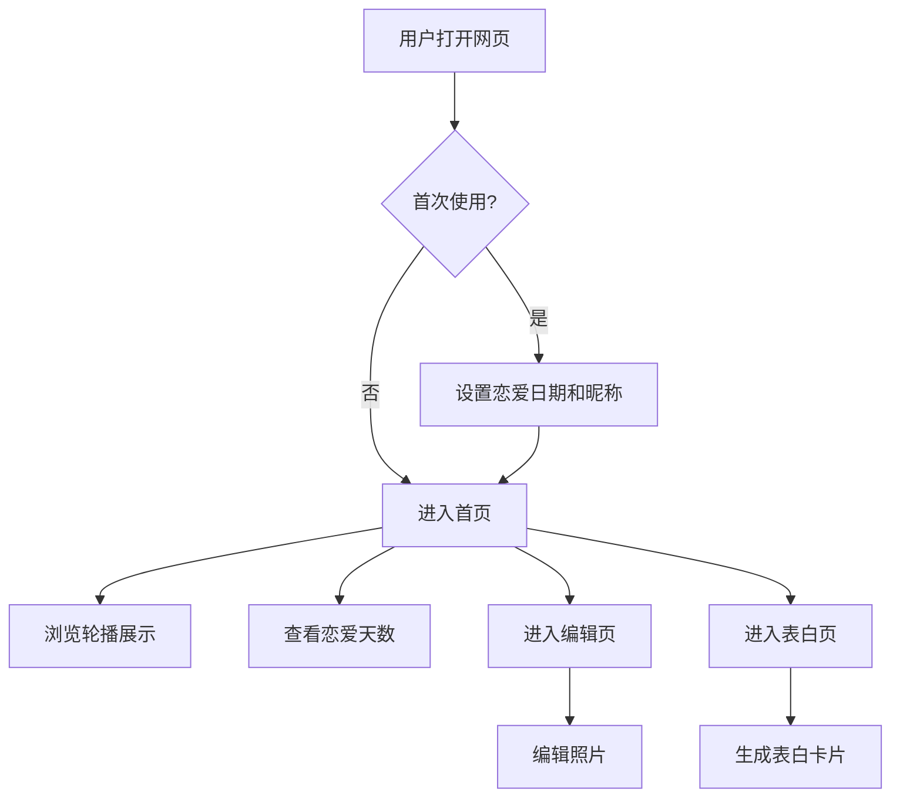

# 产品需求文档 (PRD)

## 1. 产品概述

**情侣纪念与表白网页** - 一个面向手机用户的日系治愈风格网页，让情侣可以创建专属的纪念页面，编辑甜蜜照片，记录美好时光。

- 目标用户：年轻情侣、想要表白或纪念恋爱时光的用户
- 核心价值：提供温馨浪漫的数字化空间，让爱情记忆永恒保存

## 2. 核心功能

### 2.1 功能模块

1. **首页轮播展示**
   - 自动轮播甜蜜照片
   - 支持手动滑动切换
   - 指示器显示当前位置

2. **照片编辑器**
   - 上传本地照片
   - 添加文字贴纸（爱心、星星、情话等）
   - 调整滤镜效果（日系柔和、复古、梦幻等）
   - 保存编辑后的照片

3. **纪念日记录**
   - 设置恋爱开始日期
   - 自动计算相恋天数
   - 显示下一个纪念日倒计时

4. **表白墙**
   - 输入对方昵称
   - 编辑表白/纪念文字
   - 选择背景主题

### 2.2 页面详情

| 页面名称 | 模块名称 | 功能描述 |
|---------|---------|---------|
| 首页 | 轮播展示区 | 全屏轮播展示甜蜜照片，自动播放，支持手势滑动 |
| 首页 | 恋爱天数卡片 | 显示相恋天数和下一个纪念日倒计时 |
| 编辑页 | 照片编辑器 | 上传、编辑、添加贴纸文字、应用滤镜 |
| 表白页 | 表白卡片生成器 | 输入内容，选择主题，生成表白卡片 |
| 设置页 | 纪念日设置 | 设置恋爱开始日期和对方昵称 |

## 3. 核心流程

### 用户主要流程

1. **首次使用流程**
   - 打开网页 → 设置恋爱开始日期和对方昵称 → 进入首页 → 浏览轮播展示

2. **日常查看流程**
   - 打开网页 → 查看恋爱天数 → 浏览轮播照片 → 欣赏美好回忆

3. **编辑照片流程**
   - 进入编辑页 → 上传照片 → 添加贴纸/文字 → 应用滤镜 → 保存到轮播

4. **生成表白卡片流程**
   - 进入表白页 → 输入表白文字 → 选择主题风格 → 生成卡片 → 分享/保存

## 4. 界面设计

### 4.1 设计风格

**日系治愈风格** - 温馨、柔和、充满爱意

- **主色调**：
  - 主色：#FFB7C5（樱花粉）
  - 辅色：#FFE4E1（浅玫瑰色）
  - 背景：#FFF5F7（粉白色）
  - 文字：#5A4A4A（暖棕色）
  - 强调：#FF9AA2（珊瑚粉）

- **按钮样式**：
  - 圆角：16px
  - 阴影：柔和投影
  - 悬停：轻微放大 + 颜色加深

- **字体**：
  - 标题：'M PLUS Rounded 1c', sans-serif（圆润可爱）
  - 正文：'Noto Sans SC', sans-serif（清晰易读）

- **布局风格**：
  - 卡片式布局
  - 大量留白
  - 圆角元素
  - 柔和阴影

- **图标/装饰**：
  - 爱心、星星、樱花等元素
  - 手绘风格装饰
  - 渐变透明效果

### 4.2 页面设计概览

| 页面名称 | 模块名称 | UI元素 |
|---------|---------|-------|
| 首页 | 轮播区 | 全屏图片轮播、自动播放指示器、手势滑动支持、渐变遮罩、甜蜜文字叠加 |
| 首页 | 恋爱天数卡 | 圆角卡片、大字体天数、爱心装饰、倒计时显示、樱花飘落动画 |
| 首页 | 底部导航 | 四个图标按钮（首页、编辑、表白、设置）、选中高亮、圆角背景 |
| 编辑页 | 照片编辑器 | 图片预览区、贴纸面板（爱心星星等）、文字输入框、滤镜选择（日系柔和等）、保存按钮 |
| 编辑页 | 工具栏 | 图标按钮排列（上传、贴纸、文字、滤镜、撤销） |
| 表白页 | 卡片生成器 | 背景主题选择（樱花、星空、海边）、文字输入区、预览区、生成按钮 |
| 表白页 | 主题选择器 | 横向滚动主题卡片、选中边框高亮 |
| 设置页 | 表单区 | 日期选择器、昵称输入框、头像上传、保存按钮 |
| 设置页 | 关于区 | 版本信息、反馈入口、清除缓存 |

### 4.3 响应式设计

**移动优先设计** - 针对手机用户优化

- 设计尺寸：375px - 428px（手机屏幕）
- 触摸目标：最小 44px x 44px
- 字体大小：不小于 14px
- 布局：单列布局，全宽元素
- 图片：自适应容器宽度
- 动画：轻量级，不影响性能

### 4.4 动画效果

**页面动画**：
- 页面切换：淡入淡出 + 轻微位移
- 轮播切换：水平滑动 + 淡入
- 卡片出现：从下方滑入 + 淡入

**交互动画**：
- 按钮点击：缩放 0.95 + 颜色变化
- 卡片悬停：轻微上浮 + 阴影加深
- 输入框聚焦：边框颜色变化 + 轻微发光

**装饰动画**：
- 樱花飘落：随机位置 + 缓慢飘落
- 爱心闪烁：透明度变化 + 轻微缩放
- 星星闪烁：随机闪烁效果

---

*PRD文档完成，待技术架构文档完成后一起提交审核。*
