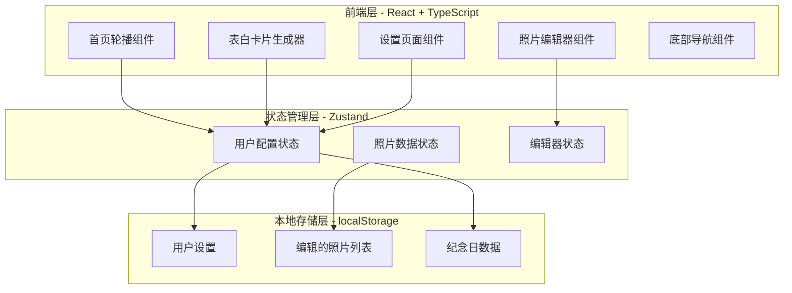

# 技术架构文档

## 1. 架构设计



## 2. 技术描述

- **前端框架**: React 18 + TypeScript
- **构建工具**: Vite 5
- **样式方案**: Tailwind CSS 3
- **状态管理**: Zustand
- **图标库**: Lucide React
- **字体**: Google Fonts (M PLUS Rounded 1c, Noto Sans SC)
- **图片处理**: Canvas API + HTML5 File API

## 3. 路由定义

| 路由 | 用途 | 组件 |
|-----|------|-----|
| / | 首页 - 轮播展示和恋爱天数 | HomePage |
| /edit | 照片编辑页面 | EditPage |
| /confession | 表白卡片生成页面 | ConfessionPage |
| /settings | 设置页面 | SettingsPage |

## 4. 组件架构

### 4.1 页面组件

```
src/pages/
├── HomePage.tsx          # 首页
├── EditPage.tsx          # 编辑页
├── ConfessionPage.tsx    # 表白页
└── SettingsPage.tsx      # 设置页
```

### 4.2 共享组件

```
src/components/
├── BottomNav.tsx         # 底部导航
├── PhotoCarousel.tsx     # 照片轮播
├── LoveDayCard.tsx       # 恋爱天数卡片
├── PhotoEditor/          # 照片编辑器
│   ├── EditorCanvas.tsx
│   ├── StickerPanel.tsx
│   ├── FilterPanel.tsx
│   └── TextTool.tsx
├── ConfessionCard/       # 表白卡片
│   ├── ThemeSelector.tsx
│   ├── CardPreview.tsx
│   └── TextEditor.tsx
└── common/               # 通用组件
    ├── Button.tsx
    ├── Input.tsx
    ├── Card.tsx
    └── Modal.tsx
```

### 4.3 自定义Hooks

```
src/hooks/
├── useLocalStorage.ts    # localStorage操作
├── usePhotoStorage.ts    # 照片数据管理
├── useLoveDay.ts         # 恋爱天数计算
├── useCanvasEditor.ts    # Canvas编辑操作
└── useCarousel.ts        # 轮播逻辑
```

### 4.4 状态管理 (Zustand)

```
src/store/
├── index.ts
├── userStore.ts          # 用户配置（昵称、日期）
├── photoStore.ts         # 照片数据
└── editorStore.ts        # 编辑器状态
```

## 5. 数据模型

### 5.1 TypeScript 类型定义

```typescript
// 用户配置
interface UserConfig {
  partnerName: string;        // 对方昵称
  startDate: string;          // 恋爱开始日期 ISO格式
  avatar?: string;            // 头像图片DataURL
}

// 照片项
interface PhotoItem {
  id: string;                 // 唯一ID
  src: string;                // 图片DataURL
  createdAt: number;          // 创建时间戳
  edited?: boolean;           // 是否编辑过
}

// 贴纸项
interface StickerItem {
  id: string;
  type: 'heart' | 'star' | 'flower' | 'text';
  x: number;
  y: number;
  scale: number;
  rotation: number;
  content?: string;           // 文字内容
}

// 编辑器状态
interface EditorState {
  currentPhoto: PhotoItem | null;
  stickers: StickerItem[];
  filter: string;             // 当前滤镜
  history: EditorSnapshot[];    // 操作历史
  historyIndex: number;
}

// 表白卡片主题
interface CardTheme {
  id: string;
  name: string;
  background: string;           // CSS渐变或图片
  fontColor: string;
  decoration: string;           // 装饰元素
}
```

## 6. 核心功能实现方案

### 6.1 照片轮播

- 使用 CSS transform + transition 实现滑动效果
- 使用 touchstart/touchmove/touchend 实现手势滑动
- 使用 setInterval 实现自动播放
- 支持循环播放（最后一张回到第一张）

### 6.2 照片编辑器

- 使用 HTML5 Canvas API 进行图像处理
- 贴纸实现：在 Canvas 上绘制图片/文字
- 滤镜实现：使用 Canvas filter API 或像素级操作
- 保存：使用 canvas.toDataURL() 导出图片

### 6.3 恋爱天数计算

```typescript
function calculateLoveDays(startDate: string): number {
  const start = new Date(startDate);
  const now = new Date();
  const diff = now.getTime() - start.getTime();
  return Math.floor(diff / (1000 * 60 * 60 * 24));
}
```

### 6.4 本地数据存储

- 使用 localStorage 存储用户配置和照片数据
- 数据结构使用 JSON 序列化
- 实现数据版本控制，便于后续迁移

## 7. 性能优化

### 7.1 图片优化

- 上传图片时进行压缩（最大 1920px 宽度）
- 使用 Canvas 生成缩略图
- 使用 object-fit: cover 保持比例

### 7.2 动画优化

- 使用 CSS transform 和 opacity 实现动画
- 使用 will-change 提示浏览器优化
- 避免在动画中修改 layout 属性

### 7.3 代码优化

- 组件懒加载（如需要）
- 使用 React.memo 避免不必要的重渲染
- 使用 useMemo/useCallback 缓存计算和回调

## 8. 项目文件结构

```
love-website/
├── .trae/
│   └── documents/
│       ├── prd.md
│       └── technical-architecture.md
├── public/
│   └── stickers/              # 贴纸资源
│       ├── heart.png
│       ├── star.png
│       └── flower.png
├── src/
│   ├── components/
│   │   ├── BottomNav.tsx
│   │   ├── PhotoCarousel.tsx
│   │   ├── LoveDayCard.tsx
│   │   ├── PhotoEditor/
│   │   │   ├── EditorCanvas.tsx
│   │   │   ├── StickerPanel.tsx
│   │   │   ├── FilterPanel.tsx
│   │   │   └── TextTool.tsx
│   │   ├── ConfessionCard/
│   │   │   ├── ThemeSelector.tsx
│   │   │   ├── CardPreview.tsx
│   │   │   └── TextEditor.tsx
│   │   └── common/
│   │       ├── Button.tsx
│   │       ├── Input.tsx
│   │       ├── Card.tsx
│   │       └── Modal.tsx
│   ├── hooks/
│   │   ├── useLocalStorage.ts
│   │   ├── usePhotoStorage.ts
│   │   ├── useLoveDay.ts
│   │   ├── useCanvasEditor.ts
│   │   └── useCarousel.ts
│   ├── pages/
│   │   ├── HomePage.tsx
│   │   ├── EditPage.tsx
│   │   ├── ConfessionPage.tsx
│   │   └── SettingsPage.tsx
│   ├── store/
│   │   ├── index.ts
│   │   ├── userStore.ts
│   │   ├── photoStore.ts
│   │   └── editorStore.ts
│   ├── types/
│   │   └── index.ts
│   ├── utils/
│   │   ├── canvas.ts
│   │   ├── filters.ts
│   │   └── date.ts
│   ├── App.tsx
│   ├── main.tsx
│   └── index.css
├── index.html
├── package.json
├── tsconfig.json
├── vite.config.ts
├── tailwind.config.js
└── postcss.config.js
```

---

*技术架构文档完成。*
